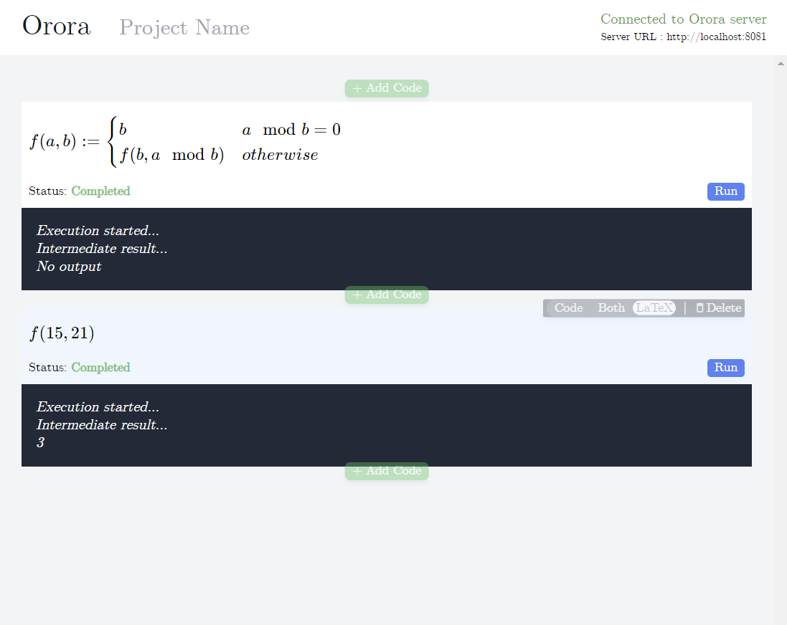

## ORORA: the programming language similar to math expression

<p align="center">
  
</p>

### How to install
```shell
sudo ./install.sh
```

- Web client: [ [Link](https://orora-lang.github.io/web-client/) ]
  : ORORA offers a primary tty client, but its Web client is more user-friendly.

#### Goal of this programming language
The grammar of ORORA should be similar to the math expression from $\LaTeX$. For example, this beta version can run the code like :

```latex
f(a, b) := 7a + 2b - 7

q :=  {\begin{bmatrix}
         1 & 2 & 3 \\
         4 & 5 & 6 \\
       \end{bmatrix} 
       + 
       \begin{bmatrix}
         6 & 5 & 4 \\
         3 & 2 & 8
       \end{bmatrix}}

f(x) := \begin{cases}
          31 & x = 1 \\
          24 & x = 2 \\
          90 & x = 3 \\
          88 & otherwise \\
        \end{cases}
```

The grammar of ORORA is designed to be similar to mathematical expressions in $\LaTeX$. For instance, this beta version can execute code such as:

###### input:
```latex
f(x) := \begin{code}
          return 2x - 1
        \end{code}

MAX := 10
i := 0
\begin{while}{1}
  i := i + 1
  j := 0
  c := ""
  k := 0
  \begin{while}{1}
    k := k + 1
    \begin{if}{k = MAX - i + 1}
      break
    \end{if}
    c := c * " "
  \end{while}
  \begin{while}{1}
    j := j + 1
    c := c * "*"
    \begin{if}{f(i) = j}
      print(c)
      break
    \end{if}
  \end{while}
  print("\n")
  \begin{if}{i = MAX}
    break
  \end{if}
\end{while}
```
###### output:
```console
         *
        ***
       *****
      *******
     *********
    ***********
   *************
  ***************
 *****************
*******************
```
